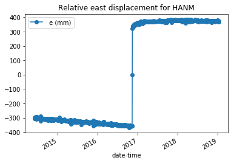

# Accessing GNSS Data in Python 
The files in this folders are Python notebooks that will demonstrate some simple ways to use the GeoNet FITS API in Python. Please note these examples use Python 3, so the syntax may differ slightly to Python 2.7. We recommend you use Python 3 as it has some important bug fixes.

File Name                     | Description | Output
----------------------------- | ------------| ----------
[Introduction](Introduction_GeoNet's_GNSS_data.ipynb)|In this notebook we will learn how to get data from one GNSS station. |
