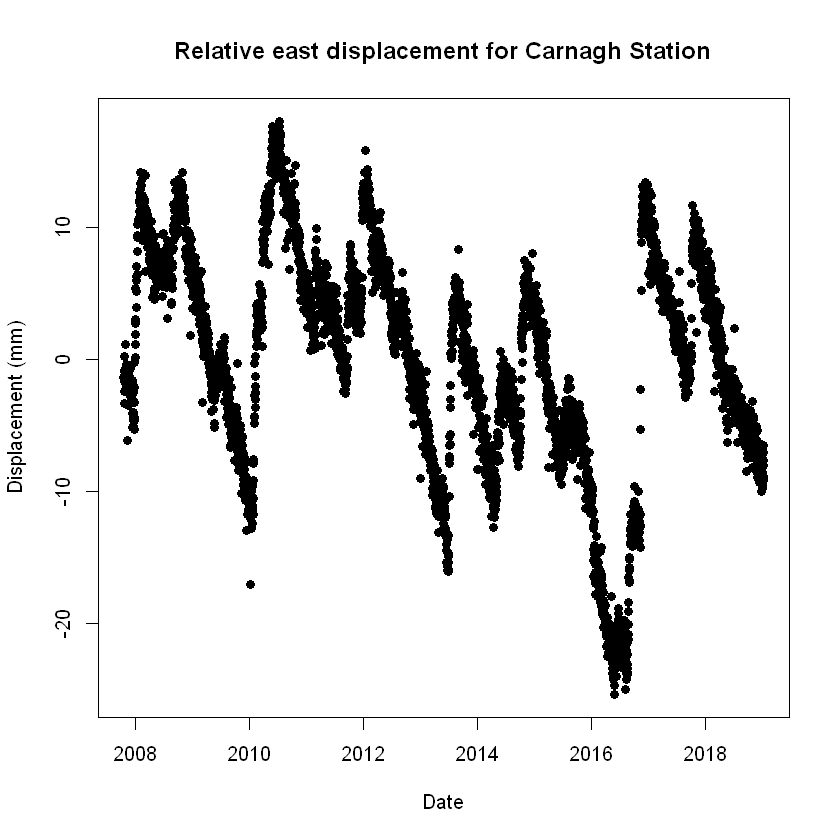
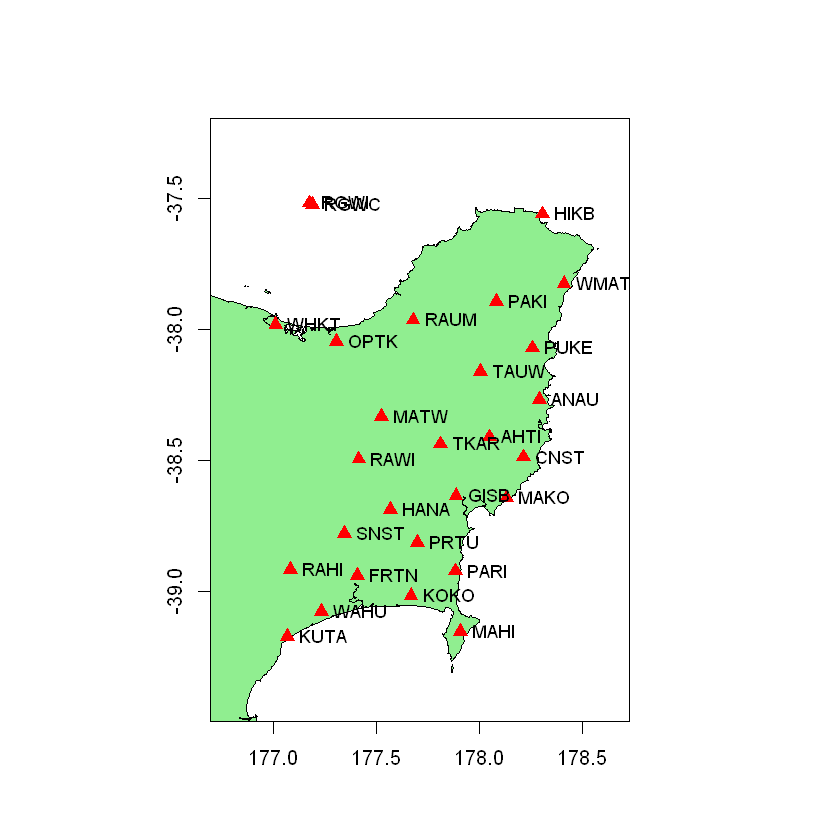
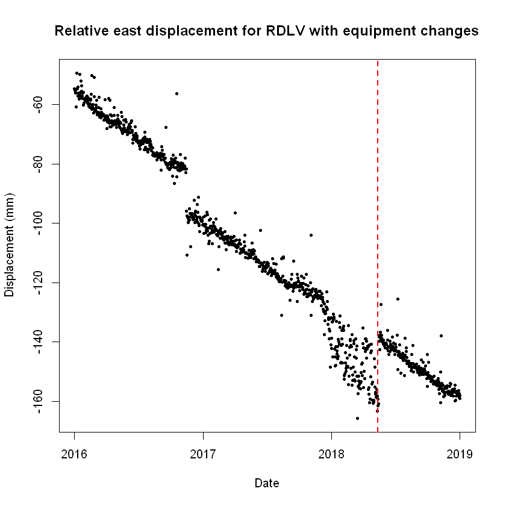

 # Accessing GNSS Data in R 
 
These R notebooks will demonstrates how to access and retrieve GNSS time series from GeoNet Network in the programming language R.

File Name                     | Description  | Output
----------------------------- | -------------|---------------------------------------
[Introduction](Introduction_to_GNSS_data_using_FITS_in_R.ipynb)|This Notebook demonstrates how to access and retrieve GNSS time series from GeoNet Network in the programming language R. | 
[Multiple station access](Multiple_station_access_for_GNSS_data_in_R.ipynb)|In this notebook we will make a map of GNSS stations in an set area, then get the data from the stations in that area. | 
[Triming and equipment changes](Triming_and_equipment_changes_for_GNSS_data.ipynb)|In this notebook we will learn how to identify equipment changes or events in GNSS time series for an specific station.|
