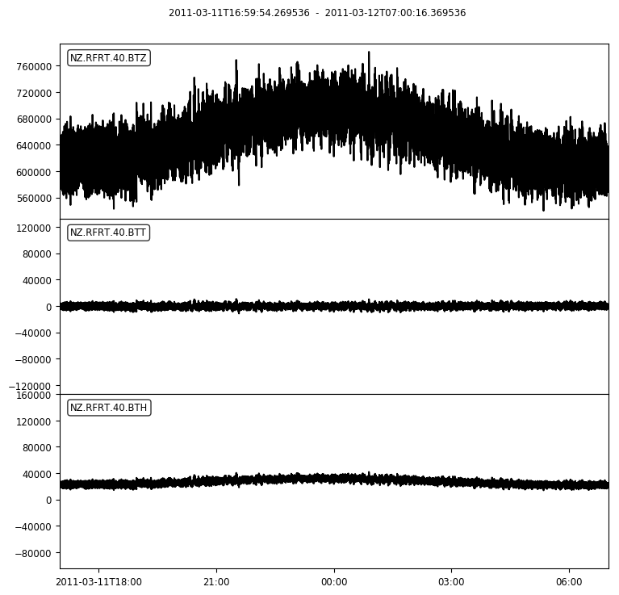

# Accessing Seismic Data in Python

The files in this folders are Python notebooks that will demonstrate some simple ways to use the GeoNet FDSN webservices in Python and with the Python module, ObsPy. Please note these examples use Python 3, so the syntax may differ slightly to Python 2.7. We recommend you use Python 3 as it has some important bug fixes.

| File | Description | Output |
|------|-------------|--------|
| [clients](GeoNet_FDSN_demo_clients.ipynb) | Demostrates different ways to manage multiple clients,  the archive and near real-time clients. | 1 Trace(s) in Stream: NZ.WEL.10.HHZ 2018-11-18T01:20:32.853131Z - 2018-11-21T01:20:35.453131Z 100.0 Hz, 25920261 samples
| [general](GeoNet_FDSN_demo_general.ipynb) | Demostrates how to get waveforms for a specific event using the event ID and utilising information returned from querying event and station services.  |
| [dataselect](GeoNet_FDSN_demo_dataselect.ipynb) | Examples of using the dataselect to request waveform data.  |
| [event](GeoNet_FDSN_demo_event.ipynb) | Examples of using the event service to get event information and parse QuakeML. |
| [station](GeoNet_FDSN_demo_station.ipynb) | Examples of using the station service to get station information and parse StationXML. | 
| [Tide Gauge](GeoNet_Tide_Gauge_Data.ipynb) | Demostrates how to get water level sensor data |
