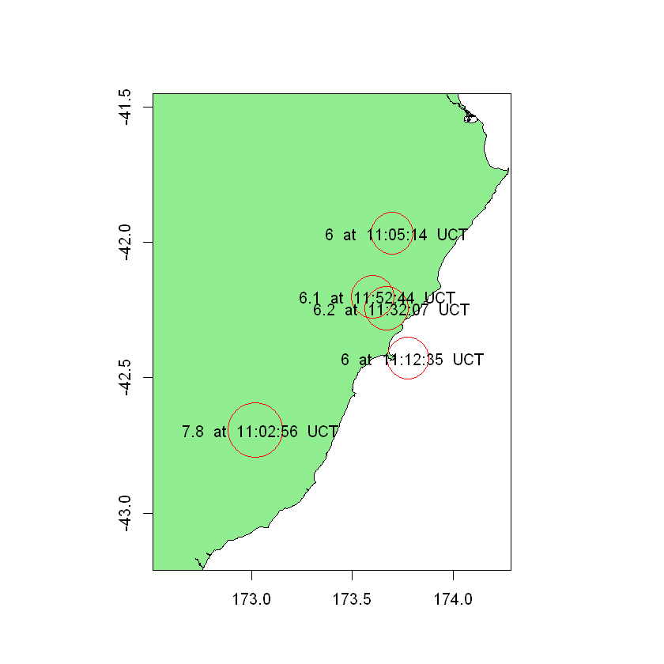
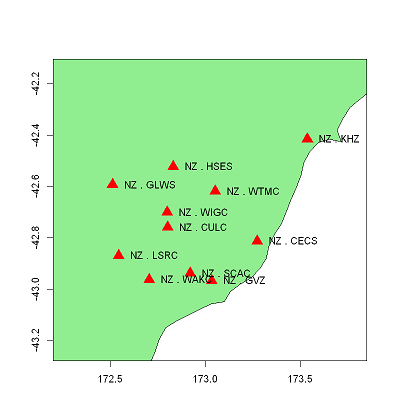
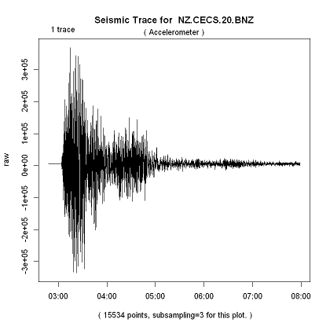
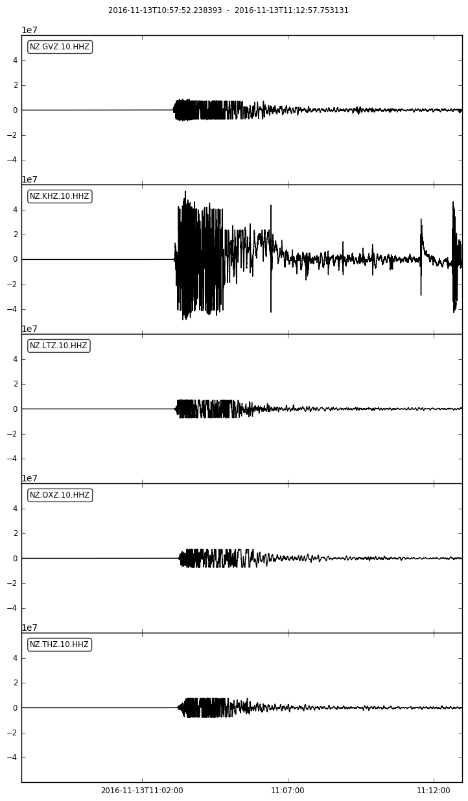
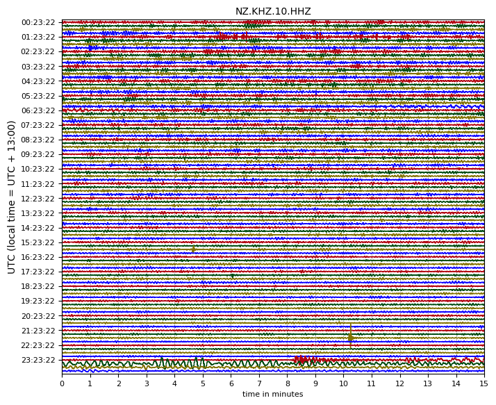
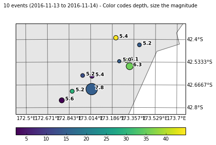
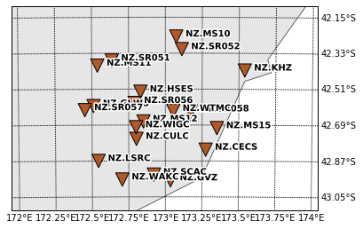

# Seismic Data 

## Accessing Seismic Data in R ## 
R notebooks that will demonstrate simple ways to use the GeoNet FDSN webservices in R.

|File                  | Description  | Output|
|--------------------- | ------|---------------------------------------|
|[FDSN Event service tutorial with R](R/Event_Data_using_FDSN_in_R.ipynb)| In this tutorial we find all the seismic events that happend in an specific time range using FDSN event service.| |
|[Overview tutorial in R](R/Seismic_data_overview_using_FDSN_in_R.ipynb)| In this tutorial we will look at the work flow from retrieving the data of the Seismic Event we wish to look at to getting waveform data and metadata on this Seismic Event.|  |
|[FDSN Station service tutorial in R ](R/Station_Data_using_FDSN_in_R.ipynb) |In this notebook we will look at the station active in a set time frame in a set area.|  |
|[FDSN Dataselect service tutorial with R](R/Get_waveform_data_using_FDSN_in_R.ipynb)| Example of using the FDSN dataselect service to request waveform data in R programming language.||

## Accessing Seismic Data in Python ## 
Python notebooks demonstrating simple ways to use the GeoNet FDSN webservices in Python and with the Python module, ObsPy. Please note these examples use Python 3, so the syntax may differ slightly to Python 2.7. We recommend you use Python 3 as it has some important bug fixes.

| File | Description | Output |
|------|-------------|--------|
| [Clients tutorial- Python](Python/GeoNet_FDSN_demo_clients.ipynb) | Demonstrates different ways to manage multiple clients, the archive and near real-time clients. | 1 Trace(s) in Stream: NZ.WEL.10.HHZ 2018-11-18T01:20:32.853131Z - 2018-11-21T01:20:35.453131Z 100.0 Hz, 25920261 samples
|[General tutorial - Python](Python/GeoNet_FDSN_demo_general.ipynb) | Demonstrates how to get waveforms for a specific event using the event ID and utilising information returned from querying event and station services.|
| [FDSN Dataselect service tutorial with Python](Python/GeoNet_FDSN_demo_dataselect.ipynb) |Examples of using the FDSN dataselect service to request waveform data in Python programming language.|
|[FDSN Event service tutorial with Python](Python/GeoNet_FDSN_demo_event.ipynb) |Examples of using the FDSN event service to get event information and parse QuakeML in Python programming language.|
| [FDSN Station service tutorial with Python](Python/GeoNet_FDSN_demo_station.ipynb) |Examples of using the FDSN station service to get station information and parse StationXML in Python programming language.| 
