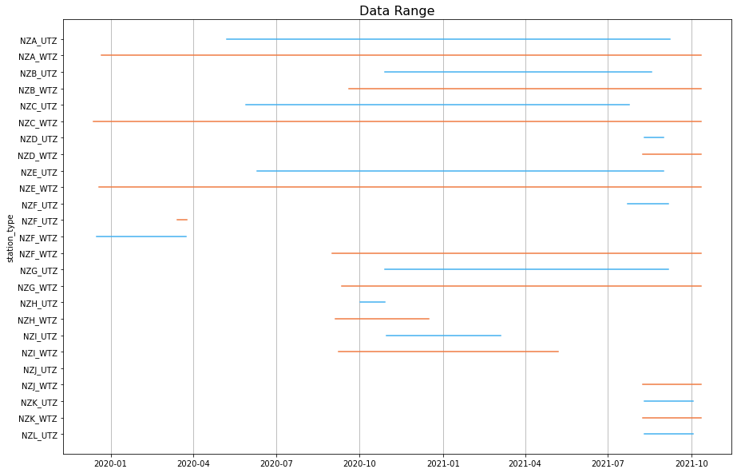
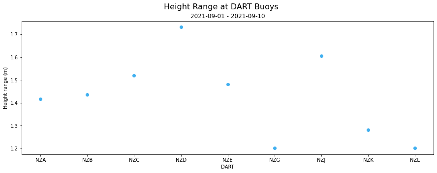

# TILDE 

## Accessing the TILDE API using Python ## 
Python notebooks demonstrating ways to use the TILDE API. Currently the only domain available is DART (Deep-ocean Assessment and Reporting on Tsunamis), when more domains are added this file will be updated.

| File | Description | Output |
|------|-------------|--------|
| [DART Data-Summary TILDE Endpoint](TILDE_endpoint01-dataSummary_DART.ipynb) | Demonstrates different ways to display DART data such as maps, bar plots and data range graphs. |
|[DART Data TILDE Endpoint](TILDE_endpoint02-data_DART.ipynb) | Demonstrates how to plot DART datapoints for high and low rate data.|
| [DART Statistics TILDE Endpoint](TILDE_endpoint03-stats_DART.ipynb) | Demonstrates how to get different statistics from the DART data set.|
