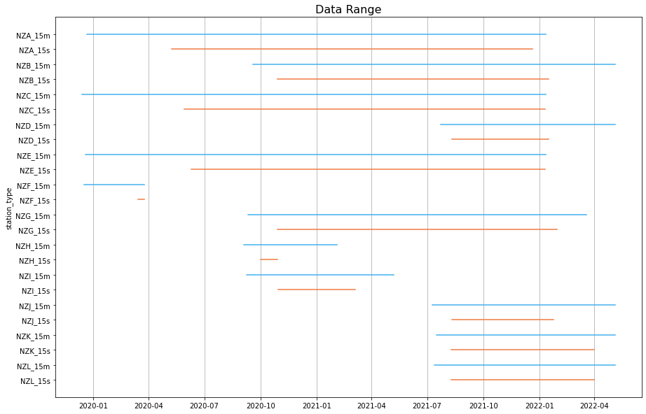
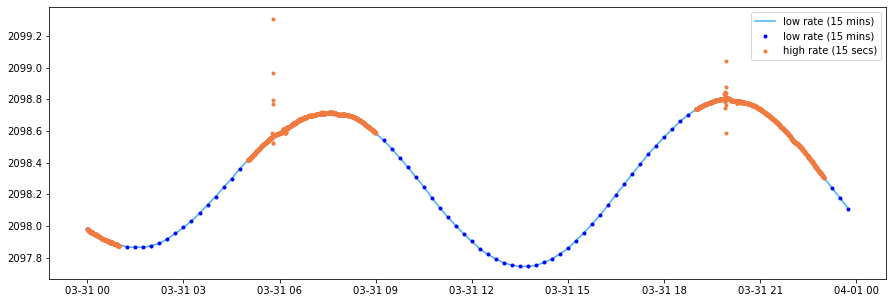
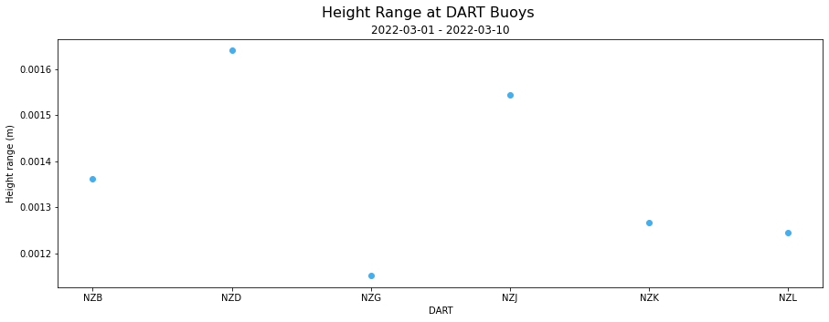
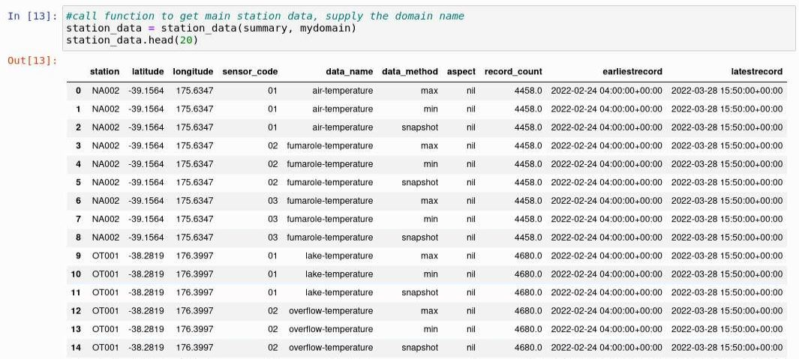
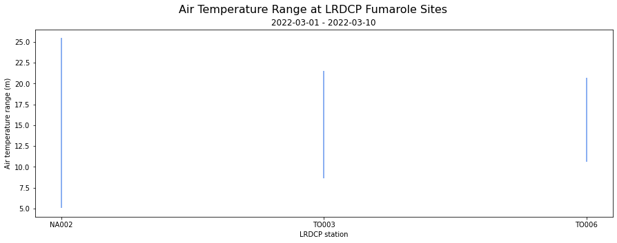

# TILDE 

## Accessing the TILDE API using Python ## 
Python notebooks demonstrating ways to use the TILDE API. Currently the only domains available are DART (Deep-ocean Assessment and Reporting on Tsunamis) and Envirosensors, when more domains are added this file will be updated. These files have all been updated (May 2022) to now use version 2 of the TILDE API. You can check the differences between version 1 and version 2 in the API documentation (https://tilde.geonet.org.nz/v1/api-docs/ and https://tilde.geonet.org.nz/v2/api-docs/). The main changes is that version 2 introduces "aspect" and for DART the method has been renamed (from UTZ to 15s and WTZ to 15m). 

| File | Description | Output |
|------|-------------|--------|
| [DART Data-Summary TILDE Endpoint](DART/TILDE_endpoint01-dataSummary_DART.ipynb) | Demonstrates different ways to display DART data such as maps, bar plots and data range graphs. |
|[DART Data TILDE Endpoint](DART/TILDE_endpoint02-data_DART.ipynb) | Demonstrates how to plot DART datapoints for high and low rate data.|
| [DART Statistics TILDE Endpoint](DART/TILDE_endpoint03-stats_DART.ipynb) | Demonstrates how to get different statistics from the DART data set.|
|[Envirosensor Data-Summary TILDE Endpoint](Envirosensor/TILDE_endpoint01-dataSummary_envirosensor.ipynb) | Demonstrates different ways to display Envirosensor data such as maps, bar plots and data range graphs. |
| [Envirosensor Data TILDE Endpoint](Envirosensor/TILDE_endpoint02-data_envirosensor.ipynb) | Demonstrates how to plot Envirosensor datapoints for minimum, maximum, snapshot and aggregated data.|
|[Envirosensor Statistics TILDE Endpoint](Envirosensor/TILDE_endpoint03-stats_envirosensor.ipynb) | Demonstrates how to get different statistics from the Envirosensor data set.|
