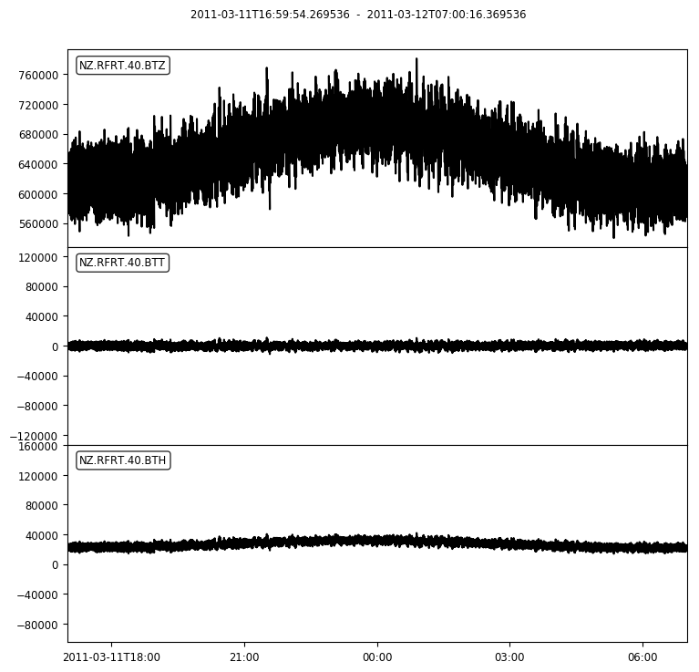

# Accessing Tide Gauge Data in Python

The file in this folder is a Python notebooks that will demonstrate some simple ways to use the GeoNet FDSN webservices in Python and with the Python module, ObsPy. Please note these examples use Python 3, so the syntax may differ slightly to Python 2.7. We recommend you use Python 3 as it has some important bug fixes.

| File | Description | Output |
|--------------------- | ------|---------------------------------------|
| [Tide Gauge](GeoNet_Tide_Gauge_Data.ipynb) | Demostrates how to get water level sensor data |

