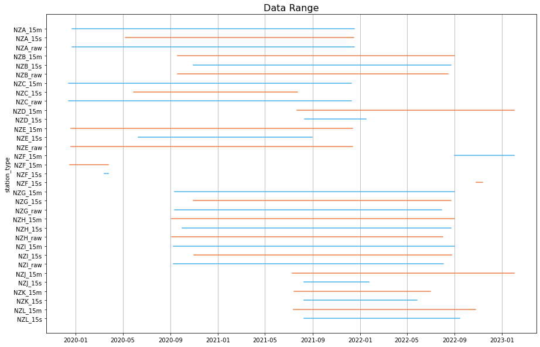
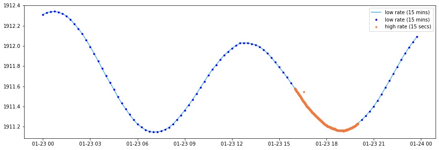
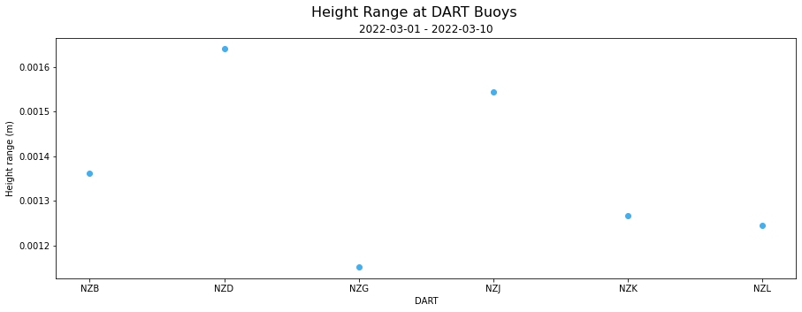
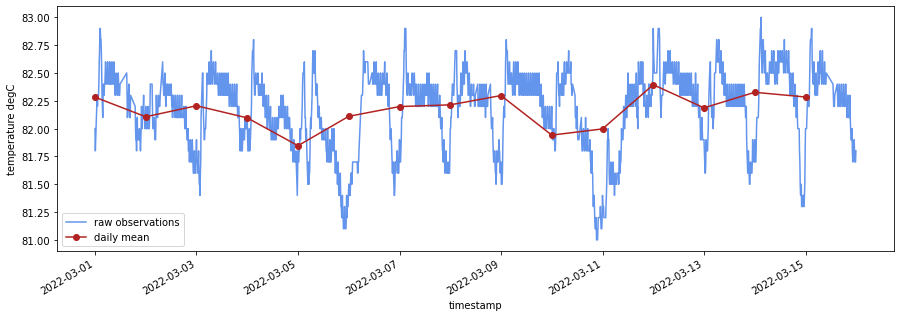
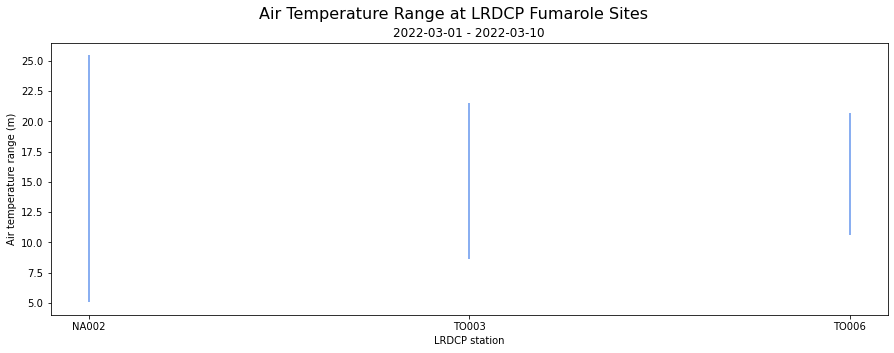

# Tilde 

## Accessing the Tilde API using Python ## 
Python notebooks demonstrating ways to use the Tilde API. Currently the only domains available are DART (Deep-ocean Assessment and Reporting on Tsunami) and Envirosensors, when more domains are added this file will be updated. These files have all been updated (February 2023) to now use version 3 of the Tilde API. You can check the differences between different versions in the API documentation (https://tilde.geonet.org.nz/v1/api-docs/, https://tilde.geonet.org.nz/v2/api-docs/ and https://tilde.geonet.org.nz/v3/api-docs/). 

| File | Description | Output |
|------|-------------|--------|
| [DART Data-Summary Tilde Endpoint](DART/Tilde_endpoint01-dataSummary_DART.ipynb) | Demonstrates different ways to display DART data such as maps, bar plots and data range graphs. |
|[DART Data Tilde Endpoint](DART/Tilde_endpoint02-data_DART.ipynb) | Demonstrates how to plot DART datapoints for high and low rate data.|
| [DART Statistics Tilde Endpoint](DART/Tilde_endpoint03-stats_DART.ipynb) | Demonstrates how to get different statistics from the DART data set.|
|[Envirosensor Data-Summary Tilde Endpoint](Envirosensor/Tilde_endpoint01-dataSummary_envirosensor.ipynb) | Demonstrates different ways to display Envirosensor data such as maps, bar plots and data range graphs. |
| [Envirosensor Data Tilde Endpoint](Envirosensor/Tilde_endpoint02-data_envirosensor.ipynb) | Demonstrates how to plot Envirosensor datapoints for minimum, maximum, snapshot and aggregated data.|
|[Envirosensor Statistics Tilde Endpoint](Envirosensor/Tilde_endpoint03-stats_envirosensor.ipynb) | Demonstrates how to get different statistics from the Envirosensor data set.|

## Accessing the Tilde API using Bash ##
A markdown file also shows a few examples of how to access the Tilde API (version 3) using bash scripting. This can be found here: [Bash Tutorial](Bash_Tilde_Access.md).
