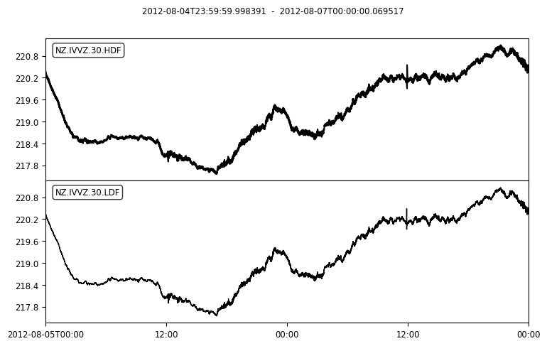

# Accessing Volcano  Data in Python 

The files in this folders are Python notebooks that will demonstrate some simple ways to access GeoNet volcan data in Python. Please note these examples use Python 3, so the syntax may differ slightly to Python 2.7. We recommend you use Python 3 as it has some important bug fixes.

File Name                     | Description  | Output
----------------------------- | -------------|---------------------------------------
[Volcano Chemistry data using FITS](Volcano_Chemistry_data_using_FITS_in_python.ipynb) | This tutorial demonstrate how to retrieve Volcano chemistry data from a set area using Python language.|  
[GeoNet's Acoustic Data](GeoNet's_Acoustic_Data.ipynb)|This tutorial will show how to get seismic-acoustic waveform data to study volcanic events.|
